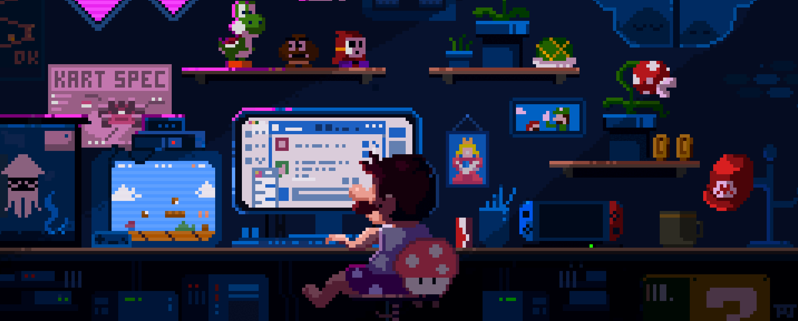

<!-- Banner img -->

<!-- My personal description -->
<article align="center">
<h1 align="center">Hi 👋, I'm Esteban</h1>

Fan of code, technology, and “what if I try this?” moments.
I enjoy learning, building useful solutions, and turning slightly crazy ideas into tools that actually work. Debugging by day, overthinking projects by night.
Sometimes I talk more to the terminal than to people… and it usually gives better responses.

</article>

<!-- stack -->
<article align="center">
    <h2>My tech stack:</h2>
    
</article>

<!-- Projects -->
<article align="center">
<h2>My Projects</h2>
<table style="width:100%">
<tr>
<td>

</td>
<td>

</td>
<td>

</td>
</tr>
<tr>
<td>

</td>
<td>

</td>
<td>

</td>
</tr>
<tr>
<td>

</td>
<td>

</td>
<td>

</td>
</tr>
</table>

</article>

<!-- Stats -->

<article align="center">
<h2>GitHub Stats:</h2>

</article>

